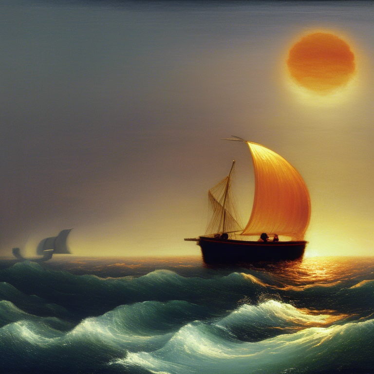
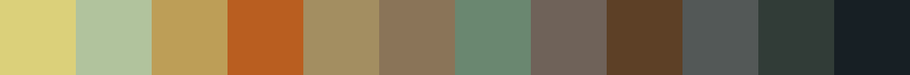
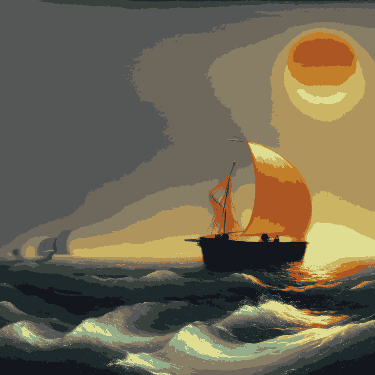
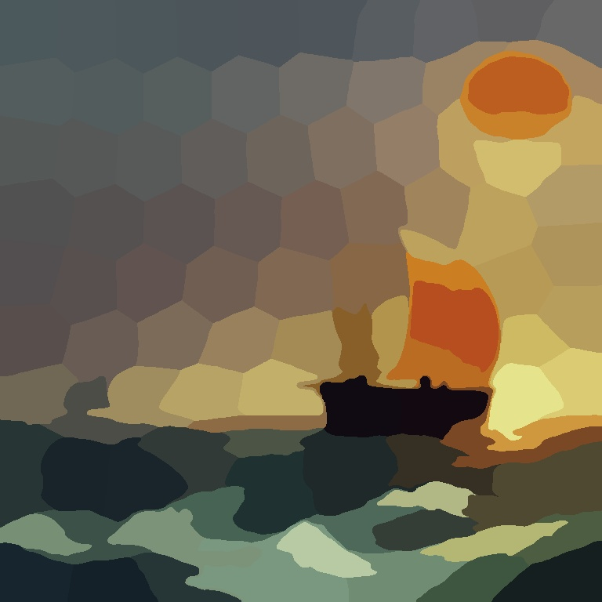
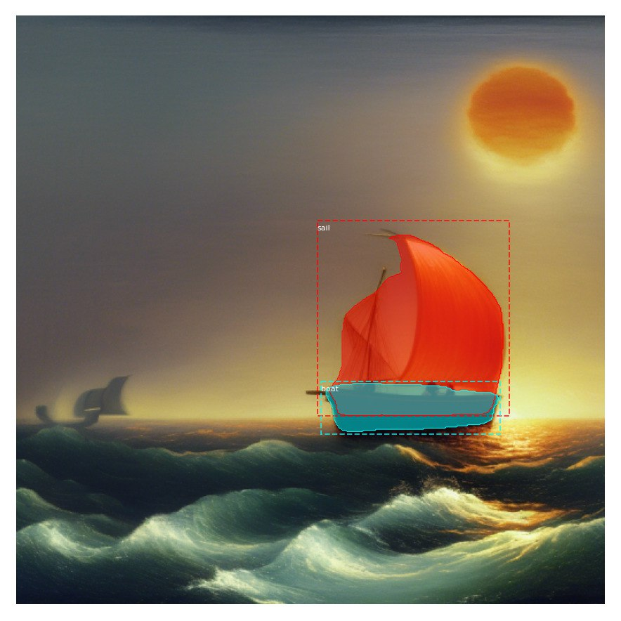
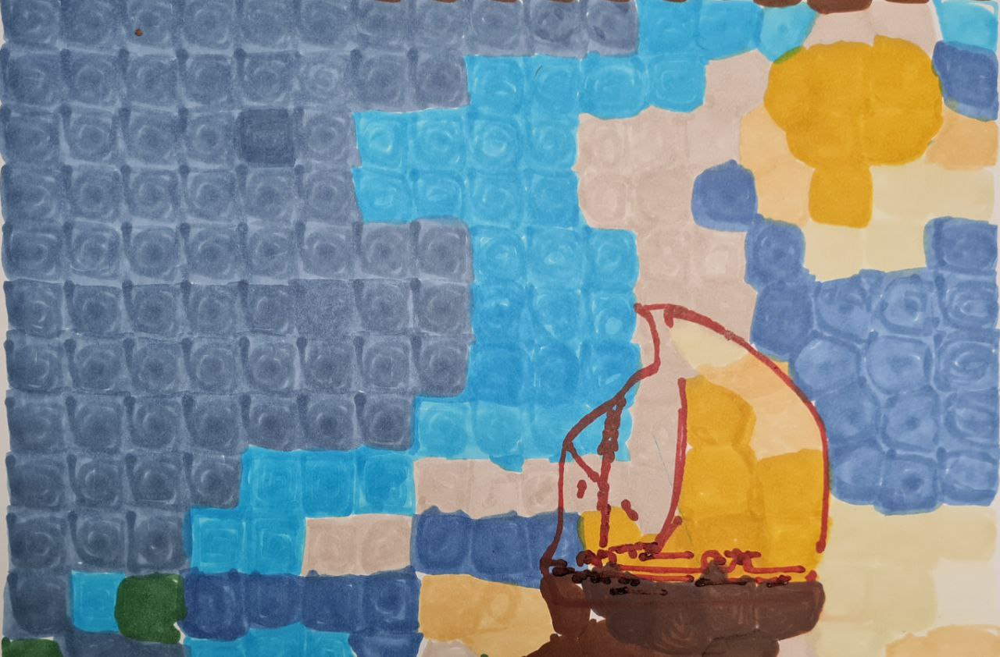

# Робот-художник
А может ли робот создавать _искусство_? Этим вопросом мы и задались и поэтому решили создать робота-художника — помощника, который сможет запечатлеть любую фразу человека на холсте.  
Для нас важно было не просто сгенерировать картинку, но и иметь ее физическое представление — настоящую картину, настоящее произведение искусства. 

## Пример работы

<table>
    <tr>
     <td><p>Нарисуем какой-нибудь несложный пейзаж. Например, попробуем нарисовать деревянный корабль в середине океана с ярко оранжевым солнцем в стиле Айвазовского. Для этого воспользуемся запросом <code>the dark brown wooden boat, the middle of the ocean, orange oval sun, landscape, aivazovsky, oil</code>. Из предложенных вариантов мы выбрали наиболее нам понравившийся. </p></td>
     <td></td>
    </tr>
</table>

<table>
    <tr>
        <p>Первым этапом обработки является выделение палитры, которую мы будем использовать для рисования. Мы решили, что можно ограничиться 12 цветами (и, на самом деле, это почти всегда оптимальное значение цветов). Как итог, мы получили палитру из 12 цветов, а также файл с перечисленными цветами в <code>BGR</code> формате.
        </p>
    </tr>
    <tr>
        
    </tr>
</table>

<table>
    <tr>
     <td><p>А также мы также получили исходную картинку, сжатую до наших 12 цветов. Дальнейшей задачей будет разбить эту картинку на области схожих цветов, а также передать эти области манипулятору, который нарисует эту картину уже на бумаге.</p></td>
     <td></td>
    </tr>
</table>

<table>
    <tr>
     <td><p>Количество этих областей тоже можно корректировать. Используя значения по умолчанию, мы получили следующее разбиение. Стоит отметить, что можно разбивать и на цельные куски одного цвета, однако это создает большие трудности в закрашивании манипулятором. Поэтому не рекомендуется так делать.</p></td>
     <td></td>
    </tr>
</table>

<table>
    <tr>
     <td><p>Также, чтобы подчеркнуть некоторые детали (такие как корабль и солнце на нашей картине, например), воспользуемся нейронной сетью <a href="https://github.com/matterport/Mask_RCNN">Mask_RCNN</a>, которая позволит найти эти предметы на картинке и выделить их. Воспользовавшись масками с предметами, можем выделить черты этих объектов контрастным маркером.</p></td>
     <td></td>
    </tr>
</table>

И в итоге, передавая, данные результаты манипулятору, можно получить похожий на такой результат


## Инструкция запуска
Для запуска вам потребуется `Python` версии `3.8` или ниже, а также библиотеки, указанные в `requirements.txt` (для `Mask_RCNN` важны именно указанные версии библиотек). Вы можете установить зависимости, используя
```
pip install -r requirements.txt
```
Также не забудьте подключить сабмодуль с нейронной сетью `Mask_RCNN`
```
git submodule init
git submodule update
```
Вам необходимо скачать файл `mask_rcnn_coco.h5` с весами с [официального репозитория](https://github.com/matterport/Mask_RCNN/releases).

Теперь вся программа запускается в несколько шагов:
1. Для получения картинки по текстовому запросу запустите файл `stable_diffusion.py`
```
python3 stable_diffusion.py <"text prompt"> /path/to/result/directory
```
2. Сжатие картинки до определенного количества цветов происходит при помощи запуска файла `quantize.py`
```
python3 quantize.py <path/to/image> (<number_of_colors>)
```
> В результате вы получите изображение, ужатое до нужного количества цветов (по умолчанию =12), палитру из этих цветов на картинке и в файле (`pallete.png` и `colors.txt` соответственно), а также области разбивающие картину.
3. Следующим шагом является получение файла для движения манипулятора. Для этого следует запустить файл `fill_areas.py`
```
python3 fill_areas.py <path/to/image> <path/to/quantized_image> <path/to/segments.txt> <path/to/colors.txt>
```
4. Далее, при желании, можно дополнить рисунок деталями при помощи `Mask_RCNN`
```
python3 objects_detection.py <path/to/image> <path/to/mask_rcnn_coco.h5>
```
> В результате вы получить файлы с масками, которые сможете разбить на контурные рисунки.
5. Для получения контурного разбиения запустите файл `contour_draw.py`
```
python3 contour_draw.py
```
И выберите нужный файл для разбиения. Подберите наиболее понравившиеся вам параметры и сохраните файл.


_Теперь у вас есть все необходимое для создания произведений искусств при помощи манипулятора!_

6. Для того, чтобы проверить полученные траектории для манипулятора, запустите визуализатор pickle файла `pickle_visualiser.py`
```
python3 pickle_visualiser.py <path/to/colors.txt> <path/to/trjs.pickle>
```
