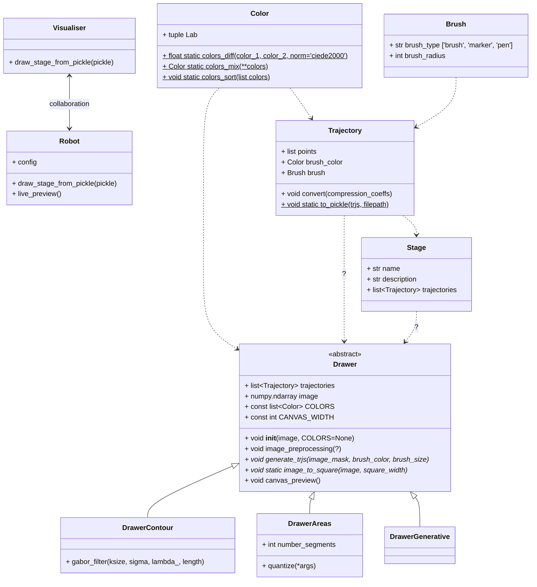

```mermaid
classDiagram
    class Drawer{
    + list~Trajectory~ trajectories
    + numpy.ndarray image
    + const list~Color~ COLORS
    + const int CANVAS_WIDTH

    + void __init__(image, COLORS=None)
    + void image_preprocessing(?)
    + void generate_trjs(image_mask, brush_color, brush_size)*
    + void static image_to_square(image, square_width)*
    + void canvas_preview()
    }
    class Robot{
        + config
        
        + draw_stage_from_pickle(pickle)
        + live_preview()
    }


    class Visualiser{

        + draw_stage_from_pickle(pickle)
    }
    <<abstract>> Drawer
    Drawer <|-- DrawerContour
    Drawer <|-- DrawerAreas
    Drawer <|-- DrawerGenerative
    Color ..> Drawer
    Trajectory ..> Drawer:?
    Stage ..> Drawer : ?
    Color ..> Trajectory
    Trajectory ..> Stage
    Brush ..> Trajectory
    class DrawerAreas{
        + int number_segments

        + quantize(*args)
    }

    class DrawerContour{
        + gabor_filter(ksize, sigma, lambda_, length)
    }

    class DrawerGenerative{

    }
    
    class Stage {
        + str name
        + str description
        + list~Trajectory~ trajectories
    }

    class Trajectory{
        + list points
        + Color brush_color
        + Brush brush
        
        + void convert(compression_coeffs)
        + void static to_pickle(trjs, filepath)$
    }

    class Brush {
        + str brush_type ['brush', 'marker', 'pen']
        + int brush_radius
    }

    class Color {
       + tuple Lab
        
       + float static colors_diff(color_1, color_2, norm='ciede2000')$
       + Color static colors_mix(**colors)$
       + void static colors_sort(list colors)$
    }


    

    Visualiser <--> Robot : collaboration
```
